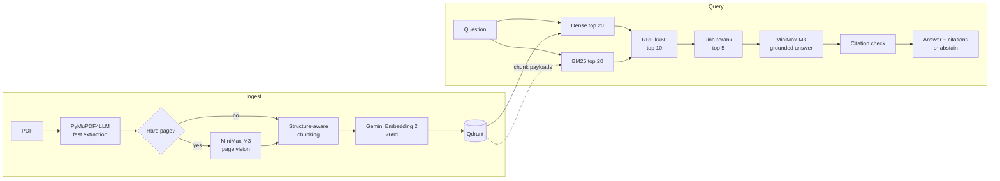

# Multimodal Enterprise RAG

Question answering over enterprise PDFs. Upload English or Hindi reports, ask in English, Hindi or Hinglish, and get answers grounded only in those documents, with validated `[document.pdf, Page N]` citations.

**Live:** [tarun.runs-on.dev](https://tarun.runs-on.dev)  
**Stack:** Python 3.12 · Streamlit · Qdrant · PyMuPDF4LLM · MiniMax-M3 · Gemini Embedding 2 · rank-bm25 · Jina Reranker v3

## How it works



1. **Extract** every page quickly with PyMuPDF4LLM into typed blocks (heading, text, table, figure, caption).
2. **Route** only hard pages to MiniMax-M3 vision; everything else keeps the fast extraction.
3. **Chunk** by structure: chunks never cross pages, keep their section path, and tables and figures stay whole.
4. **Embed** with Gemini Embedding 2 (768d, cached in SQLite) and store in Qdrant (cosine).
5. **Retrieve** with dense search plus BM25, fuse by rank with RRF, rerank with Jina.
6. **Answer** with MiniMax-M3 from the top 5 chunks, then validate every citation.

## Selective multimodal understanding

Sending every page to a vision model is slow: a 9-page M3 batch took about 30 s. So a page goes to M3 only when a deterministic check says fast extraction may have lost something:

| Signal | Rule | M3 output stored as |
|---|---|---|
| Scanned | < 50 non-space characters and an image covering ~40% of the page | `figure` blocks |
| Garbled | ≥ 1% U+FFFD replacement characters | re-transcribed `text` |
| Legacy Hindi font | ≥ 50% of the page's Latin letters in a known pre-Unicode Hindi font (Kruti Dev, Arjun, …); fallback: Latin text with < 32% vowels and ≥ 20% words with in-word punctuation (`m\|ksx`) | re-transcribed `text` |
| Informational figure | large figure whose caption is not an event photo ("Glimpses…", "Hon'ble…", "…held at…") | figure content |
| Broken table | ≥ 50% of data cells empty | `table` |

Pages are rendered at 150 DPI. M3 output is stored as **document content, never as an answer**, then chunked and embedded like any other block. If M3 fails, the fast extraction is kept. Results are cached in `data/cache/understanding.sqlite`.

## Retrieval and grounding

- **Hybrid search.** Dense retrieval handles paraphrase and cross-language queries; BM25 catches exact names, numbers and terms. Its tokenizer is Unicode-aware, so Devanagari words stay whole.
- **One source of truth.** The BM25 index is rebuilt in memory from the chunks stored in Qdrant, so the two indexes cannot drift.
- **RRF over ranks.** Dense and BM25 scores are not comparable, so they are fused by rank (k=60).
- **Untrusted context.** Retrieved text is sent inside delimited `<source>` blocks, with the rules restated after it, so instructions hidden in a PDF are ignored.
- **Citation validation.** Each `[document, Page N]` must match a retrieved chunk. A bare `[Page N]` is accepted only if exactly one document has that page. Invalid citations are removed; if none remain, the system answers `INSUFFICIENT_CONTEXT`.
- **Thinking disabled for answers.** M3 can start its answer inside `<think>` ([MiniMax-M3#28](https://github.com/MiniMax-AI/MiniMax-M3/issues/28)), which would cut the opening words, so answers run with thinking off.

## Design choices

| Component | Chosen | Tried | Why |
|---|---|---|---|
| PDF extraction | PyMuPDF4LLM (~6.6 s) | Docling (56–185 s) | Docling was accurate but too slow for a prototype |
| Vision | MiniMax-M3 | MiniMax-M2.7 | M2.7 failed the tested charts and images |
| Embeddings | Gemini Embedding 2 (19 chunks ~1.7 s) | BGE-M3, BGE-small/base, Qwen3-Embedding-0.6B | Local models too slow or English-focused |
| Reranker | Jina Reranker v3 (19 pairs ~1.45 s) | BGE reranker v2-m3, Voyage | Too slow locally / rate limits |
| Orchestration | Plain Python modules | — | No LangChain or LangGraph; the pipeline is linear and easy to debug. FastAPI is only a thin HTTP adapter (`api.py`) |

Other decisions:

- **Idempotent ingestion.** `document_id` is the first 16 hex characters of the PDF's SHA-256, and chunk and point IDs derive from it. Re-ingesting upserts, then deletes stale chunks. Cached embeddings are never recomputed, so an interrupted ingestion resumes cheaply.
- **Session isolation.** Each browser session gets its own Qdrant collection, deleted after 24 h of inactivity. The CLI uses a separate shared `documents` collection that the app never reads.

## Project structure

```text
app.py              Streamlit UI
api.py              HTTP API for a UI (FastAPI adapter, single-workspace prototype)
rag/
  config.py         models, constants, settings from env
  extract.py        PDF -> typed page blocks
  understand.py     page routing + MiniMax-M3 vision
  chunk.py          structure-aware chunks with metadata
  embed.py          Gemini embeddings + SQLite cache
  store.py          Qdrant collection and upserts
  bm25.py           Unicode-aware BM25
  retrieve.py       dense + BM25 -> RRF -> rerank
  rerank.py         Jina client
  generate.py       grounded prompt, citation validation, M3 client
  ingest.py         ingestion pipeline + CLI
  session.py        per-session collections and cleanup
tests/              offline pytest suite
evals/              30-question gold set
```

## Run locally

Requires [uv](https://docs.astral.sh/uv/) and Docker.

```bash
uv sync
docker run -d --name rag-qdrant -p 127.0.0.1:6333:6333 \
  -v rag_qdrant_storage:/qdrant/storage qdrant/qdrant:latest
cp .env.example .env          # fill in the API keys
uv run streamlit run app.py   # http://127.0.0.1:8501
```

Qdrant must be running before the app starts.

| Variable | Required | Purpose |
|---|---|---|
| `MINIMAX_API_KEY` | yes | Page understanding and answers |
| `GEMINI_API_KEY` | yes | Embeddings |
| `JINA_API_KEY` | yes | Reranking |
| `MINIMAX_BASE_URL` | no | OpenAI-compatible MiniMax endpoint |
| `QDRANT_URL` | no | Default `http://127.0.0.1:6333` |
| `QDRANT_API_KEY` | no | Only if Qdrant requires one |

Keys are read only from the environment or a gitignored `.env`, and are redacted from errors shown in the UI.

```bash
uv run pytest                               # offline suite; live tests are skipped
uv run python -m rag.ingest file.pdf ...    # CLI ingestion (shared collection)
uv run python -m rag.retrieve "question"    # CLI retrieval
RAG_LIVE_TESTS=1 uv run pytest tests/test_live_retrieval.py -v -s
```

The live test sends English, Hindi, Hinglish and cross-language queries through real Gemini, Qdrant and Jina. One Hinglish → Devanagari case is marked `xfail` because Jina demotes the correct chunk out of first place.

## HTTP API (prototype)

`api.py` exposes the same pipeline over HTTP for a UI. It is only an adapter: ingestion, retrieval, reranking, generation, prompts and citation validation are the unchanged `rag/` code.

```bash
uv run uvicorn api:app --host 127.0.0.1 --port 8000 --workers 1   # docs at http://127.0.0.1:8000/docs
```

| Endpoint | Purpose |
|---|---|
| `GET /api/health` | Qdrant reachability (never calls Gemini, Jina or MiniMax); 503 when Qdrant is down |
| `GET /api/documents` | Documents in the workspace, derived from Qdrant payloads (no chunk text). Status: `ready`, `incomplete` (stored points from an unfinished write; upload again), `queued`, `processing`, `failed`, or `empty` (no extractable text) |
| `POST /api/documents` | Multipart `file` (PDF). 202 queued; 200 if the identical PDF is already stored and complete (nothing is re-processed); 409 if it is queued, processing or being deleted; 429 if the queue is full; 413 too large; 415 not a PDF |
| `DELETE /api/documents/{document_id}` | Removes all of a document's chunks; 404 unknown, 409 queued, processing or already being deleted. Uploads of that document get 409 until the deletion finishes |
| `POST /api/chat` | `{"question": ...}` → `answer`, `abstained`, `citations` (`[document, Page N]` validated against the retrieved chunks), `sources`. Abstains exactly as the app does; raw model output is never returned. 503 if Qdrant fails, 502 if the embedder, reranker or answer model fails |

- **Single workspace, no authentication.** Every client shares one Qdrant collection, `API_COLLECTION` (default `documents`, the one the CLI also writes to). There is no per-client isolation. Do not expose the API publicly: keep it on localhost behind a reverse proxy with TLS and access control.
- **Background ingestion on one worker thread.** PDFs can take minutes, beyond proxy timeouts, and PyMuPDF must not run on several threads at once. At most one upload runs and one waits; further uploads get 429, so at most two PDFs are held in memory. Progress (`stage`, `pages`, `chunks`, `new_embeddings`, `error`) appears in `GET /api/documents`; a waiting upload shows stage `queued`.
- **Completeness.** Every stored chunk carries its write's `chunk_total` and `write_id`. A document is `ready` only when all its points come from one write and their number matches `chunk_total`, so a write cut short by a failure or a restart shows as `incomplete`, never `ready`. Points stored before these fields existed also show as `incomplete` until uploaded again. Retrieval uses the same rule: dense search and BM25 only consider chunks of complete documents, so an `incomplete` document never contributes to an answer (the Streamlit app and the CLI included). While a document is being re-ingested it drops out of search until the new write finishes.
- **One process.** Job state is in memory, so run a single Uvicorn worker; a restart forgets queued uploads (re-uploading is cheap: ingestion is idempotent and cached). Stopping the process waits for a running ingestion to finish.
- `API_MAX_UPLOAD_MB` (default 200) limits upload size. Starlette receives the whole request before that check runs, so the reverse proxy must enforce the same limit, e.g. nginx `client_max_body_size 200M;`.

## Deployment

```text
Internet -> Nginx (HTTPS, Let's Encrypt) -> Streamlit 127.0.0.1:8501 -> Qdrant 127.0.0.1:6333
                                                    |
                                                    +-> MiniMax, Gemini, Jina APIs
```

Runs on an OCI VM with Docker and systemd. Streamlit and Qdrant both bind to localhost; only Nginx is public. The app has no authentication, so access control belongs at the proxy.

## Evaluation

[`evals/gold.jsonl`](evals/gold.jsonl) holds 30 questions over three public annual reports: English, Hindi, Hinglish, cross-language, tables, visual pages, unanswerable questions and prompt injection. The PDFs are not committed. No end-to-end score (accuracy, Recall@K, faithfulness) is claimed yet; the set exists so those can be measured reproducibly.

## Limitations

- No authentication; session isolation is not access control.
- Legacy non-Unicode Hindi fonts (e.g. Arjun, BHARTIYA-HINDI_081) extract as Latin gibberish. Pages that are mostly legacy text are re-read by M3; an English page with only a little legacy text (a Hindi heading, say) keeps that text as gibberish.
- Unicode Hindi extraction drops parts of some conjuncts and doubles some vowel signs, which weakens BM25.
- Routing thresholds are heuristic: uncaptioned or decorative images can still reach M3, and vector-drawn charts are missed.
- Refreshing the page starts a new, empty session.
- Single process, not load-tested.
