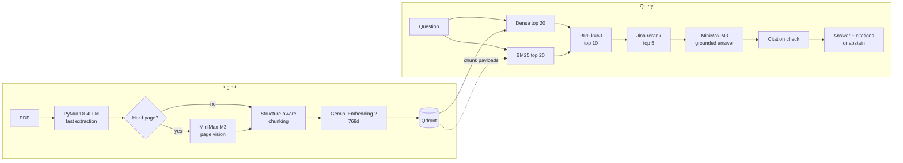

# Multimodal Enterprise RAG

Question answering over enterprise PDFs. Upload English or Hindi reports, ask in English, Hindi or Hinglish, and get answers grounded only in those documents, with validated `[document.pdf, Page N]` citations.

**Live:** [tarun.runs-on.dev](https://tarun.runs-on.dev)  
**Stack:** Next.js · FastAPI · Python 3.12 · Qdrant · PyMuPDF4LLM · MiniMax-M3 · Gemini Embedding 2 · rank-bm25 · Jina Reranker v3

## How it works



1. **Extract** every page quickly with PyMuPDF4LLM into typed blocks (heading, text, table, figure, caption).
2. **Route** only hard pages to MiniMax-M3 vision; everything else keeps the fast extraction.
3. **Chunk** by structure: chunks never cross pages, keep their section path, and tables and figures stay whole.
4. **Embed** with Gemini Embedding 2 (768d, cached in SQLite) and store in Qdrant (cosine).
5. **Retrieve** with dense search plus BM25, fuse by rank with RRF, rerank with Jina.
6. **Answer** with MiniMax-M3 from the top 5 chunks, then validate every citation.

## Selective multimodal understanding

Sending every page to a vision model is slow: a 9-page M3 batch took about 30 s. So a page goes to M3 only when a deterministic check says fast extraction may have lost something:

| Signal | Rule | M3 output stored as |
|---|---|---|
| Scanned | < 50 non-space characters and an image covering ~40% of the page | `figure` blocks |
| Garbled | ≥ 1% U+FFFD replacement characters | re-transcribed `text` |
| Legacy Hindi font | ≥ 50% of the page's Latin letters in a known pre-Unicode Hindi font (Kruti Dev, Arjun, …); fallback: Latin text with < 32% vowels and ≥ 20% words with in-word punctuation (`m\|ksx`) | re-transcribed `text` |
| Informational figure | large figure whose caption is not an event photo ("Glimpses…", "Hon'ble…", "…held at…") | figure content |
| Broken table | ≥ 50% of data cells empty | `table` |

Pages are rendered at 150 DPI. M3 output is stored as **document content, never as an answer**, then chunked and embedded like any other block. If M3 fails, the fast extraction is kept. Results are cached in `data/cache/understanding.sqlite`.

## Retrieval and grounding

- **Hybrid search.** Dense retrieval handles paraphrase and cross-language queries; BM25 catches exact names, numbers and terms. Its tokenizer is Unicode-aware, so Devanagari words stay whole.
- **One source of truth.** The BM25 index is rebuilt in memory from the chunks stored in Qdrant, so the two indexes cannot drift.
- **RRF over ranks.** Dense and BM25 scores are not comparable, so they are fused by rank (k=60).
- **Untrusted context.** Retrieved text is sent inside delimited `<source>` blocks, with the rules restated after it, so instructions hidden in a PDF are ignored.
- **Citation validation.** Each `[document, Page N]` must match a retrieved chunk. A bare `[Page N]` is accepted only if exactly one document has that page. Invalid citations are removed; if none remain, the system answers `INSUFFICIENT_CONTEXT`.
- **Thinking disabled for answers.** M3 can start its answer inside `<think>` ([MiniMax-M3#28](https://github.com/MiniMax-AI/MiniMax-M3/issues/28)), which would cut the opening words, so answers run with thinking off.

## Design choices

| Component | Chosen | Tried | Why |
|---|---|---|---|
| PDF extraction | PyMuPDF4LLM (~6.6 s) | Docling (56–185 s) | Docling was accurate but too slow for a prototype |
| Vision | MiniMax-M3 | MiniMax-M2.7 | M2.7 failed the tested charts and images |
| Embeddings | Gemini Embedding 2 (19 chunks ~1.7 s) | BGE-M3, BGE-small/base, Qwen3-Embedding-0.6B | Local models too slow or English-focused |
| Reranker | Jina Reranker v3 (19 pairs ~1.45 s) | BGE reranker v2-m3, Voyage | Too slow locally / rate limits |
| Frontend | Next.js + shadcn/ui, a client of the API | Streamlit (V1 prototype) | A production UI needs real routing, accessibility, responsive layout and source presentation; all RAG logic stays behind FastAPI |
| Orchestration | Plain Python modules | — | No LangChain or LangGraph; the pipeline is linear and easy to debug. FastAPI is only a thin HTTP adapter (`api.py`) |

Other decisions:

- **Idempotent ingestion.** `document_id` is the first 16 hex characters of the PDF's SHA-256, and chunk and point IDs derive from it. Re-ingesting upserts, then deletes stale chunks. Cached embeddings are never recomputed, so an interrupted ingestion resumes cheaply.
- **One shared workspace.** The web app and the HTTP API use one Qdrant collection (`documents` by default), the same one the CLI writes to.

## Architecture

```text
Browser
  -> Next.js web app (web/)             UI only; its server forwards /api/* to FastAPI
    -> FastAPI (api.py) 127.0.0.1:8000  the application boundary
      -> rag/ pipeline                  extraction, M3, chunking, embeddings, retrieval, answers
        -> Qdrant 127.0.0.1:6333 · MiniMax, Gemini and Jina APIs
```

The frontend holds no RAG logic and knows nothing about Qdrant, embeddings, BM25, fusion or reranking. The browser only calls same-origin `/api/*`. A Next.js route handler ([`web/app/api/[...path]/route.ts`](web/app/api/[...path]/route.ts)) forwards exactly the five endpoints below to FastAPI at `RAG_API_URL` and nothing else. It streams request bodies (a 200 MB upload is never held in memory), forwards no cookies or credentials, and reduces every reply to the fields the UI uses, so chunk ids, point counts, exception names and database details never reach the browser. FastAPI itself stays on localhost.

## Project structure

```text
api.py              HTTP API (FastAPI adapter, single shared workspace)
rag/
  config.py         models, constants, settings from env
  extract.py        PDF -> typed page blocks
  understand.py     page routing + MiniMax-M3 vision
  chunk.py          structure-aware chunks with metadata
  embed.py          Gemini embeddings + SQLite cache
  store.py          Qdrant collection and upserts
  bm25.py           Unicode-aware BM25
  retrieve.py       dense + BM25 -> RRF -> rerank
  rerank.py         Jina client
  generate.py       grounded prompt, citation validation, M3 client
  ingest.py         ingestion pipeline + CLI
  session.py        services, ingestion and answering for the API
web/                Next.js + TypeScript + Tailwind + shadcn/ui frontend
  app/              routes: / (chat), /documents, /api/[...path] (proxy to FastAPI)
  components/       sidebar, chat, documents, sources, shadcn/ui primitives
  hooks/, lib/      polling, conversations, typed API client, status and citation mapping
  tests/            Vitest + Testing Library
deploy/             systemd units and Nginx site for the VM
tests/              offline pytest suite
evals/              30-question gold set
```

## Run locally

Requires [uv](https://docs.astral.sh/uv/), Node.js 24 LTS (≥ 24.15) or 22 (≥ 22.22.2) and Docker. Next.js 16 alone needs Node ≥ 20.9; the test toolchain (Vitest, jsdom) needs the versions above, which `web/package.json` `engines` records.

```bash
uv sync
docker run -d --name rag-qdrant -p 127.0.0.1:6333:6333 \
  -v rag_qdrant_storage:/qdrant/storage qdrant/qdrant:latest
cp .env.example .env          # fill in the API keys

# terminal 1: the API
uv run uvicorn api:app --host 127.0.0.1 --port 8000 --workers 1

# terminal 2: the web app
cd web && npm ci && npm run dev -- --hostname 127.0.0.1   # http://127.0.0.1:3000
```

Qdrant must be running before the API starts.

| Variable | Used by | Purpose |
|---|---|---|
| `MINIMAX_API_KEY` | API (required) | Page understanding and answers |
| `GEMINI_API_KEY` | API (required) | Embeddings |
| `JINA_API_KEY` | API (required) | Reranking |
| `MINIMAX_BASE_URL` | API | OpenAI-compatible MiniMax endpoint |
| `QDRANT_URL`, `QDRANT_API_KEY` | API | Default `http://127.0.0.1:6333`; key only if Qdrant requires one |
| `API_COLLECTION` | API | Workspace collection, default `documents` |
| `API_MAX_UPLOAD_MB` | API | Upload limit, default 200 |
| `RAG_API_URL` | web server | Where the Next.js server reaches FastAPI, default `http://127.0.0.1:8000` |

Only the API reads keys, from the environment or a gitignored `.env`, and redacts them from errors. The web app holds no secrets.

```bash
uv run pytest                               # backend: offline suite; live tests are skipped
cd web && npm test && npm run lint && npm run typecheck && npm run build   # frontend
uv run python -m rag.ingest file.pdf ...    # CLI ingestion (shared collection)
uv run python -m rag.retrieve "question"    # CLI retrieval
RAG_LIVE_TESTS=1 uv run pytest tests/test_live_retrieval.py -v -s
```

The live test sends English, Hindi, Hinglish and cross-language queries through real Gemini, Qdrant and Jina. One Hinglish → Devanagari case is marked `xfail` because Jina demotes the correct chunk out of first place.

## Web app

- **Chat:** a document-style conversation. Enter sends, Shift+Enter adds a line. The start screen suggests questions about the ready documents by name; a new question scrolls to the top; the open conversation survives a reload. Every question is one `POST /api/chat`; earlier turns stay in the browser tab for display only and are never sent. Validated citations become numbered markers, sources are grouped by document page, and opening one shows the document, page, content type, section and passage text.
- **Documents:** drag and drop or pick PDFs (up to 200 MB), see upload progress, then Waiting to process → Reading document → Understanding complex pages → Building index → Finalizing → Ready. Processing failed, Index incomplete (upload the same file again to repair it) and No readable content are explained. Delete asks for confirmation. The list is polled every 2 s only while something is queued or processing, and uploads beyond the API's queue wait in the browser until a slot frees.
- **Tables:** tables in answers and in source passages (PyMuPDF4LLM extracts them as pipe tables) render as real tables with numeric columns right-aligned; cells stay plain text.
- **Emoji:** every emoji, in the interface and inside answers or documents, is drawn with Apple's emoji artwork so it looks the same on every device. `npm run dev`/`npm run build` copy the images from the `emoji-datasource-apple` package into `web/public/emoji/` (generated, not committed; served lazily). Apple's emoji artwork is Apple's copyright and is not licensed for general web use; the project owner has chosen to ship it.
- **Workspace:** collapsible sidebar (Ctrl/⌘ B) with conversations and documents, command menu (Ctrl/⌘ K), light, dark and system themes. Below 1024 px (phones and tablets) the sidebar becomes a drawer and sources open in bottom sheets; touch screens get 40 px+ tap targets and 16 px input text.
- **Safety:** document text, file names and sources render as plain text. Answers go through a Markdown renderer that drops HTML and images and renders no links except citation markers. No chunk ids, scores, internal ids or model reasoning are shown, and server error details never reach the page.

## HTTP API

`api.py` exposes the pipeline over HTTP; the web app is its only client. It is only an adapter: ingestion, retrieval, reranking, generation, prompts and citation validation are the unchanged `rag/` code.

```bash
uv run uvicorn api:app --host 127.0.0.1 --port 8000 --workers 1   # docs at http://127.0.0.1:8000/docs
```

| Endpoint | Purpose |
|---|---|
| `GET /api/health` | Qdrant reachability (never calls Gemini, Jina or MiniMax); 503 when Qdrant is down |
| `GET /api/documents` | Documents in the workspace, derived from Qdrant payloads (no chunk text). Status: `ready`, `incomplete` (stored points from an unfinished write; upload again), `queued`, `processing`, `failed`, or `empty` (no extractable text) |
| `POST /api/documents` | Multipart `file` (PDF). 202 queued; 200 if the identical PDF is already stored and complete (nothing is re-processed); 409 if it is queued, processing or being deleted; 429 if the queue is full; 413 too large; 415 not a PDF |
| `DELETE /api/documents/{document_id}` | Removes all of a document's chunks; 404 unknown, 409 queued, processing or already being deleted. Uploads of that document get 409 until the deletion finishes |
| `POST /api/chat` | `{"question": ...}` → `answer`, `abstained`, `citations` (`[document, Page N]` validated against the retrieved chunks), `sources`. Abstains when the context is insufficient; raw model output is never returned. 503 if Qdrant fails, 502 if the embedder, reranker or answer model fails |

- **Single workspace, no authentication.** Every client shares one Qdrant collection, `API_COLLECTION` (default `documents`, the one the CLI also writes to). There is no per-client isolation. Do not expose the API publicly: keep it on localhost behind a reverse proxy with TLS and access control.
- **Background ingestion on one worker thread.** PDFs can take minutes, beyond proxy timeouts, and PyMuPDF must not run on several threads at once. At most one upload runs and one waits; further uploads get 429, so at most two PDFs are held in memory. Progress (`stage`, `pages`, `chunks`, `new_embeddings`, `error`) appears in `GET /api/documents`; a waiting upload shows stage `queued`.
- **Completeness.** Every stored chunk carries its write's `chunk_total` and `write_id`. A document is `ready` only when all its points come from one write and their number matches `chunk_total`, so a write cut short by a failure or a restart shows as `incomplete`, never `ready`. Points stored before these fields existed also show as `incomplete` until uploaded again. Retrieval uses the same rule: dense search and BM25 only consider chunks of complete documents, so an `incomplete` document never contributes to an answer (the CLI included). While a document is being re-ingested it drops out of search until the new write finishes.
- **One process.** Job state is in memory, so run a single Uvicorn worker; a restart forgets queued uploads (re-uploading is cheap: ingestion is idempotent and cached). Stopping the process waits for a running ingestion to finish.
- `API_MAX_UPLOAD_MB` (default 200) limits upload size. Starlette receives the whole request before that check runs, so the reverse proxy must enforce the same limit, e.g. nginx `client_max_body_size 200M;`.

## Deployment

```text
Internet -> Nginx (HTTPS, Let's Encrypt, access control)
              -> Next.js (node server.js) 127.0.0.1:3000
                   -> FastAPI (uvicorn api:app, 1 worker) 127.0.0.1:8000
                        -> Qdrant (Docker) 127.0.0.1:6333
                        -> MiniMax, Gemini, Jina APIs
```

Runs on the OCI VM (Ubuntu 24.04, ARM64) with Docker for Qdrant and two systemd units, [`deploy/rag-api.service`](deploy/rag-api.service) and [`deploy/rag-web.service`](deploy/rag-web.service), the web unit ordered after the API. Only Nginx is public ([`deploy/nginx.conf`](deploy/nginx.conf)): it proxies everything to Next.js, which serves the UI and forwards `/api/*` server-side. Nginx never proxies to FastAPI directly. No extra containers; other services on the VM are left alone.

```bash
# on the VM, from the repository checkout (Node.js 24 LTS for linux-arm64, and uv, installed)
uv sync --frozen
(cd web && npm ci && npm run build)      # builds web/.next/standalone with its static assets
sudo cp deploy/rag-*.service /etc/systemd/system/ && sudo systemctl daemon-reload
sudo systemctl enable --now rag-api rag-web
```

The units assume the checkout at `/opt/multimodal-enterprise-rag`, run as user `rag`; adjust both to the VM. After pulling changes, rebuild the web app and `sudo systemctl restart rag-api rag-web`.

**Nginx basic auth is required.** The app has no authentication and one shared workspace: anyone who reaches it can read every document and delete it. [`deploy/nginx.conf`](deploy/nginx.conf) enables `auth_basic` for the whole site; create the password file first (`sudo htpasswd -c /etc/nginx/rag.htpasswd <user>`, from `apache2-utils`) and check `sudo nginx -t`. Without it Nginx fails closed with 500, but do not expose the site until a login is required. Keep `client_max_body_size 200M;` (Starlette reads an upload fully before the API's own size check) and a read timeout longer than the slowest answer.

## Evaluation

[`evals/gold.jsonl`](evals/gold.jsonl) holds 30 questions over three public annual reports: English, Hindi, Hinglish, cross-language, tables, visual pages, unanswerable questions and prompt injection. The PDFs are not committed. No end-to-end score (accuracy, Recall@K, faithfulness) is claimed yet; the set exists so those can be measured reproducibly.

## Limitations

- No authentication and one shared workspace: everyone with access sees, uses and can delete every document.
- Legacy non-Unicode Hindi fonts (e.g. Arjun, BHARTIYA-HINDI_081) extract as Latin gibberish. Pages that are mostly legacy text are re-read by M3; an English page with only a little legacy text (a Hindi heading, say) keeps that text as gibberish.
- Unicode Hindi extraction drops parts of some conjuncts and doubles some vowel signs, which weakens BM25.
- Routing thresholds are heuristic: uncaptioned or decorative images can still reach M3, and vector-drawn charts are missed.
- Conversation history lives in the browser tab only (sessionStorage); the backend is single-turn.
- Single process, not load-tested.
